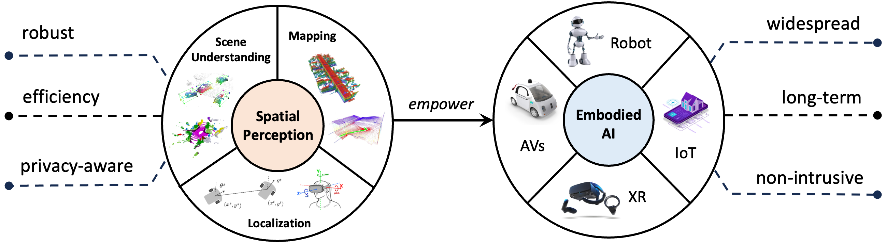

<h2>about me</h2>

I am a Postdoctoral Associate at MIT, working with [Dr. Hermano Igo Krebs](https://meche.mit.edu/people/faculty/hikrebs@mit.edu), director of [The 77 Lab](https://the77lab.mit.edu/). Before MIT, I worked with [Dr. Or Litany](https://orlitany.github.io/) at Technion as a Postdoctoral Fellow. I was honored to be awarded a [2025 RSS Pioneer](https://sites.google.com/view/rsspioneers2025/participants?authuser=0) for my work on robust spatial perception for mobile robotics. I received my Ph.D. in Robotics and Autonomous Systems from School of Informatics, The University of Edinburgh, supervised by [Dr. Chris Xiaoxuan Lu](https://christopherlu.github.io/), and my B.Eng. in Mechanical Engineering from Tongji University. 

🎯 My research agenda centers on **Physical AI**, which integrates advanced artifcial intelligence with *physical* systems (e.g., autonomous vehicles, robots, xR, industrial and IoT devices) to enable them to perceive, understand, and interact in the *physical* world. My long-term vision is a *human–machine symbiotic ecosystem* where human and embodied intelligence coexist, collaborate and co-evolve. Achieving this vision requires systems that are *robust* under changing conditions, *responsible* around humans, and *affordable* to deploy at scale. This motivates my research goals along three key axes: (i) **condition-adaptive:** maintaining robustness across illumination, weather, and environmental shifts; (ii) **privacy-aware:** protecting user identity and sensitive content in privacy-critical applications; (iii) **cost-effective:** reducing reliance on expensive sensors and compute devices as well as costly real-world data collection and manual labeling.

💡 My current and ongoing research directions include (but not limited to):

-  Multisensor fusion for reliable mobile autonomoy in the wild
-  Long-horizon robotic manipulation across tasks and environments
-  Scaling humanoid behaviour from human motion priors
-  Non-intrusive human motion and physical interaction sensing
-  Physics-grounded embodied foundation models
-  Building deployable data flywheel for scalable robot learning

🤝 If you are interested in these directions and would like to explore collaboration opportunities, please feel free to reach out via email.

<!-- 
My research focuses on advancing the robustness, efficiency, and privacy-awarness of spatial perception for **Physical AI** systems. These efforts making AI to better support physical systems such as autonomous vehicles and robots, IoT and xR, aiming to facilitate their **widespread, long-horizon and non-intrusive** deployment in the wild.  -->

<!--  -->

<!-- I am also keen to incorporate full-spectral multi-modal fusion into my research field. -->

<!-- Before coming to Edinburgh, I received my B.Eng degree with the highest honour - <a href="https://news.tongji.edu.cn/info/1003/76035.htm?ivk_sa=1023197a" target="_blank" rel="noopener">Academic Star</a> and was awarded double National Scholarships from <a href="https://en.tongji.edu.cn" target="_blank" rel="noopener">Tongji University</a> (2017-2021). -->

<!-- where I worked in the <a href="https://vision4robotics.github.io/" target="_blank">V4R lab</a> under the supervision of <a href="https://www.researchgate.net/profile/Changhong-Fu" target="_blank">Dr. Changhong Fu</a>. In August 2020, I visited Tsinghua University and conducted on-site research under the supervison of <a href="https://ieeexplore.ieee.org/author/38237039900" target="_blank">Dr. Geng Lu</a>.  -->
<!-- 👉 I am looking for self-motivated UG/Ms students to work with me and my collaborators at UoE/UCL/ETH/MIT/Oxford/Cambridge/NTU on **cutting-edge** research projects. -->

<!-- , including but not limited to: 
-  **Mapping**: All-day scene completion with thermal imaging for mobile autonomy  
-  **Scene Understanding**: Robust and low-cost perception enabled by surrounding 4D radars
-  **Human Motion**: Human motion reconstruction from mmWave raw data via Diffusion
-  **Representation Learning**: Pre-trained transformer for heterogeneous radar sensors -->

<!-- Support in the form of **sufficient** computational and sensory tools, robot platform, alongside **practical** supervision and direction, is available. Please contact directly via email if you are interested. -->

<!-- 👉 I am actively looking for a research intern position this year. Shoot me an email if you think I am a good fit!  -->
