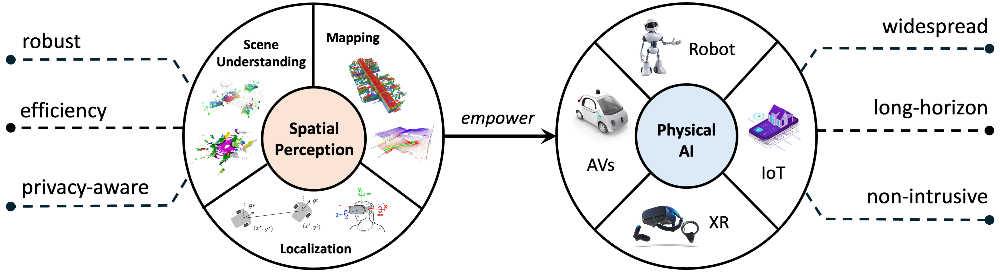

<h2>about me</h2>
I am a Postdoctoral Associate at MIT, advised by <a href="https://meche.mit.edu/people/faculty/hikrebs@mit.edu" target="_blank">Dr. Hermano Igo Krebs</a>, director of <a href="https://the77lab.mit.edu/" target="_blank">The 77 Lab</a>. Previously, I worked with <a href="https://orlitany.github.io/" target="_blank">Dr. Or Litany</a> as a Research Fellow at Technion. I was honored to be awarded a <a href="https://sites.google.com/view/rsspioneers2025/participants?authuser=0" target="_blank">2025 RSS Pioneer</a> for my work on robust spatial perception with 4D radar for mobile autonomy. I received my PhD degree in Robotics and Autonomous Systems from the School of Informatics, University of Edinburgh, supervised by <a href="https://christopherlu.github.io/" target="_blank">Dr. Chris Xiaoxuan Lu</a>, and my B.Eng degree from <a href="https://en.tongji.edu.cn" target="_blank" rel="noopener">Tongji University</a>.

My research focuses on advancing the robustness, efficiency, and privacy-awarness of perception systems for **Physical AI**. These efforts support autonomous system like mobile robots, self-driving cars, AIoT and xR-integrated systems, aiming to facilitate their **widespread, long-horizon and non-intrusive** deployment in the wild. Currently, my works primarily involve the robust imaging modalities, e.g., mmWave radar and thermal camera, leveraging their unique sensing resilience to cope with **adverse weather, variable illumination and occlusion** challenges in real world. 

<!-- I am also keen to incorporate full-spectral multi-modal fusion into my research field. -->

<!-- Before coming to Edinburgh, I received my B.Eng degree with the highest honour - <a href="https://news.tongji.edu.cn/info/1003/76035.htm?ivk_sa=1023197a" target="_blank" rel="noopener">Academic Star</a> and was awarded double National Scholarships from <a href="https://en.tongji.edu.cn" target="_blank" rel="noopener">Tongji University</a> (2017-2021). -->

<!-- where I worked in the <a href="https://vision4robotics.github.io/" target="_blank">V4R lab</a> under the supervision of <a href="https://www.researchgate.net/profile/Changhong-Fu" target="_blank">Dr. Changhong Fu</a>. In August 2020, I visited Tsinghua University and conducted on-site research under the supervison of <a href="https://ieeexplore.ieee.org/author/38237039900" target="_blank">Dr. Geng Lu</a>.  -->
<!-- 👉 I am looking for self-motivated UG/Ms students to work with me and my collaborators at UoE/UCL/ETH/MIT/Oxford/Cambridge/NTU on **cutting-edge** research projects. -->

<!-- , including but not limited to: 
-  **Mapping**: All-day scene completion with thermal imaging for mobile autonomy  
-  **Scene Understanding**: Robust and low-cost perception enabled by surrounding 4D radars
-  **Human Motion**: Human motion reconstruction from mmWave raw data via Diffusion
-  **Representation Learning**: Pre-trained transformer for heterogeneous radar sensors -->

<!-- Support in the form of **sufficient** computational and sensory tools, robot platform, alongside **practical** supervision and direction, is available. Please contact directly via email if you are interested. -->

<!-- 👉 I am actively looking for a research intern position this year. Shoot me an email if you think I am a good fit!  -->
